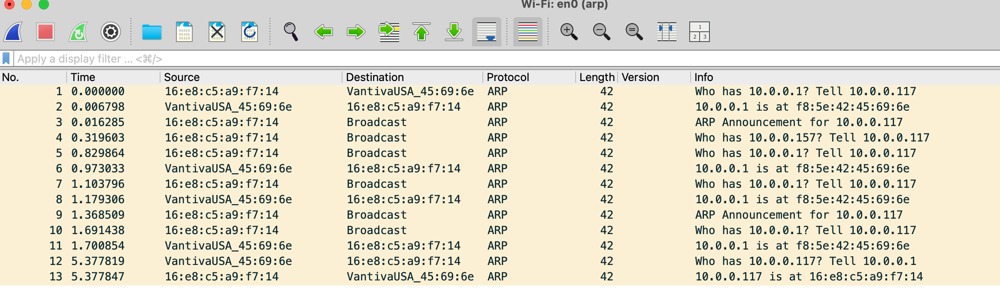

# Network Discovery (ARP & Gateway Behavior)

## Goal
Understand how my Mac finds the router

## Setup

### Capture Filter
Use the following capture filter before starting Wireshark:

```bash
arp
```

## Results



Wi-Fi turns ON

My Macbook gets IP: 10.0.0.117

My Macbook asks: “Who is 10.0.0.1?”

Router replies with MAC

My Macbook announces itself

ARP refresh & validation

